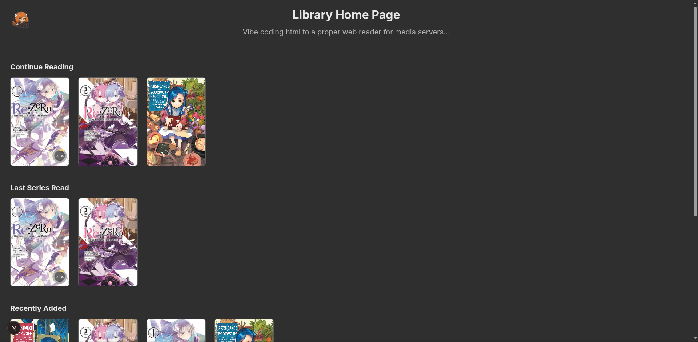
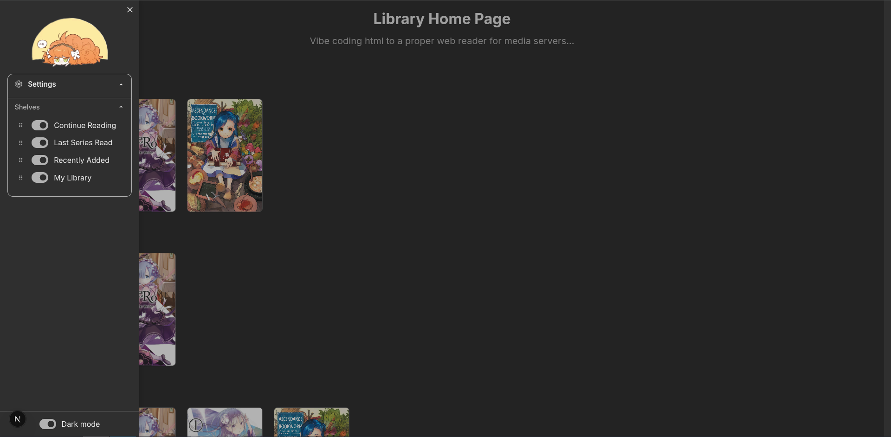
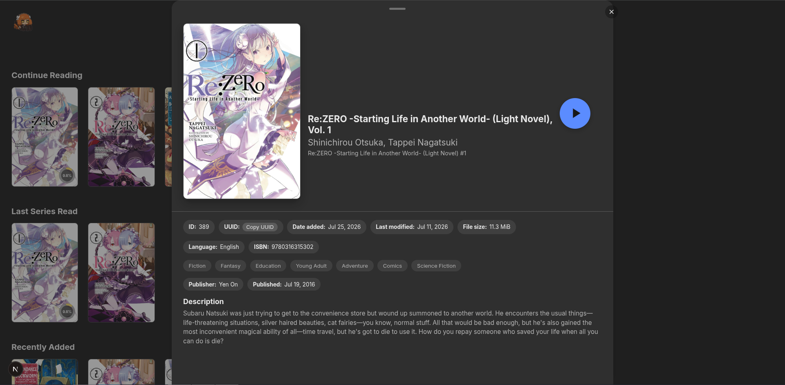
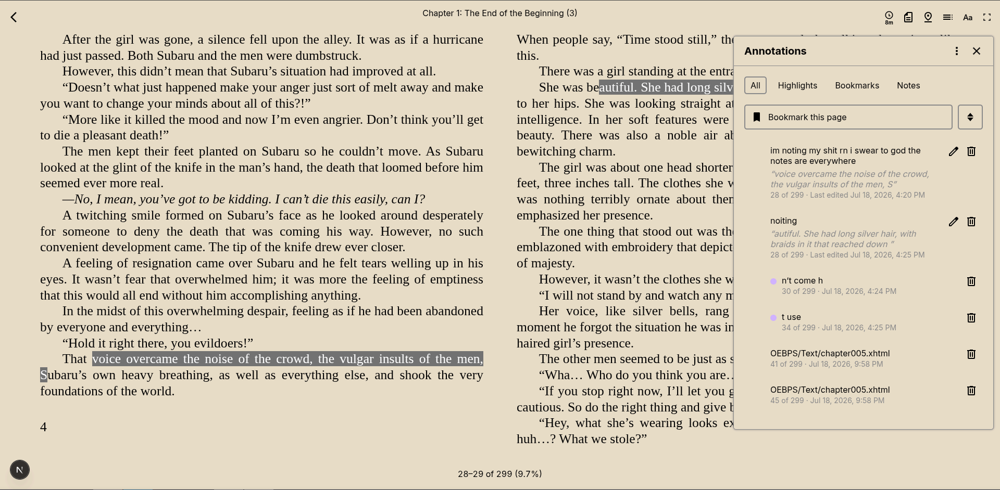
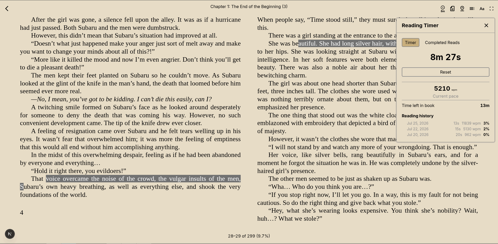
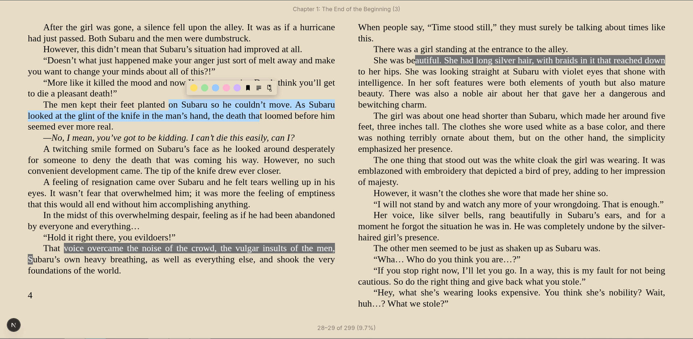
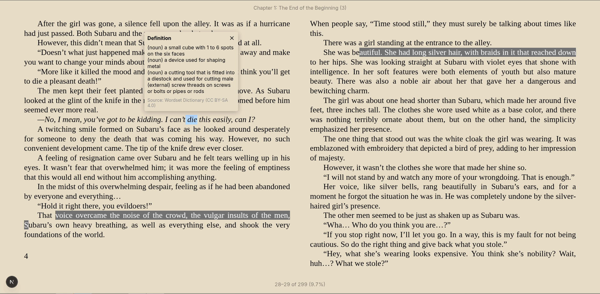

# ***Disclaimer***
I cloned the thorium repository and have been vibecodin the fuck out of it so that the reader and library page behave the way I want them to. I can not promise that this is a stable, secure, or well engineered app, but I can say that I test every feature I try to have Claude make so that it functions at the least. If you happen to try this personal project, bug reports would be nice.

# Example Images









# Planned Features
## Progress Tracking
- ~~Base thorium appears to save book position in your browser's local storage instead of alongside the server's files~~
- ~~The first step to enabling reader progress saving at the server level is changing the save location from the browser that loads the website to the server itself~~
	- Tracking a specific account's progress via a tag would also be a nice feature
- After that we need a way to read books without Internet connection in the case of an android app. This will require a way to connect to the server and stream the books while syncing the *most recent* position update to the server
- It would nee![[Pasted image 20260727021145.png]]d a way to download the books to the device and present them while tracking the position. Then a way to track the same book. Probably the base64 encoding we currently use for book web pages and resolve which state is the most recent upon reconnection to the server.
- ~~For sync purposes the books should probably be identified with a deterministic hash like with KOsync~~
## Login Page
- Base thorium doesn't have accounts or a log in page so it will be imperative to create a firm security front to prevent bad actors from getting into the site.
- This mean I will need accounts, log ins, and a way to prevent each page on the site from being accessed without valid credentials along with a way to encrypt the check for those credentials.
## Library Interface
- ~~Move the settings menu to an overlay accessed by clicking the logo~~
	- Have all the reader settings there
	- Light dark mode button
	- User stuff once we get there
- ~~Custom shelves~~
- Automatic series shelves based off the readium meta data
- Make the last read series thing on the homepage one wide and you click the right to move further in the volumes
- ~~Series # ordering~~
- ~~Meta data view~~
	- ~~Display the 1024 character "pages" calculated by readium and the pages based on the current viewport settings~~
- The settings menu should have fields for the readium server url, ~~epub directory,~~ and the userdata folder
- ~~Note and etc. access outside the book~~
- ![[Pasted image 20260719094350.png]]
	- ~~Done~~
## Reader Functions
- Thorium already has a lot of features out of the box but I would like to add some
	- ~~Allow setting the margin, and font size manually~~
		- couldn't get vertical margin to work, the default seems fine.
	- ~~Make landscape images render across two pages in double column mode~~
	- ~~more keyboard shortcuts?~~
		- ~~Tab - Table of Contents~~
		- ~~Up Arrow - Zoom in~~
		- ~~Down Arrow - Zoom out~~
		- ~~Escape - Exit to library~~
	- ~~Highlighting~~
	- ~~Bookmarking~~
	- ~~Notes~~
		- Accessible outside of the book itself
	- ~~Dictionary Integration~~
	- ~~Track time spent reading~~
		- ~~Reset~~
		- ~~Save Completion times~~
		- ~~Display~~
			- ~~Delete~~
	- ~~words per minute tracking~~
	- ~~Click on image to expand it with a easy to click button to leave it~~
	- ~~Dynamic page number and current page display based on the viewport and remaining "pages"~~
# Thorium Web

Thorium Web is a web-based reader for EPUB and other digital publications, built using Next.js and modern web technologies. It is designed to provide a fast, responsive, and accessible reading experience.


## Features

- Supports EPUB
- Fast and responsive rendering of publications using Next.js
- Accessible design for readers with disabilities
- Customizable reading experience with themes, adjustable font sizes, line heights, word- and letter-spacing, etc.

## Getting Started

There are two ways to get started with Thorium Web:

- Using the Next.JS App as is
- Using the Thorium Web package in your own project

You can take a look at the [Implementers’ Guide](./docs/ImplementersGuide.md) for more details.

### Using the Next.JS App as is

To get started with Thorium Web, follow these steps:

- Fork or clone the repository: `git clone https://github.com/edrlab/thorium-web.git`
- Install dependencies: `pnpm install`
- Start the development server: `pnpm dev`
- Open the reader in your web browser: [http://localhost:3000](http://localhost:3000)

The development server will automatically reload the page when you make changes to the code.

### Using the Thorium Web package in your own project

To use Thorium Web in your own project, install the package and its peer dependencies:

```bash
npm install @edrlab/thorium-web @readium/css @readium/navigator @readium/navigator-html-injectables @readium/shared react-redux @reduxjs/toolkit i18next i18next-browser-languagedetector i18next-http-backend motion react-aria react-aria-components react-stately react-modal-sheet react-resizable-panels 
```

Then you can import and use the components in your own code:

```tsx
import { StatefulReader } from "@edrlab/thorium-web/epub"

const MyApp = () => {
  // ... fetch the manifest and get its self link href
  return (
    <StatefulReader
      rawManifest={ manifestObject }
      selfHref={ manifestSelfHref }
    />
  )
}
```

You can use the StatefulReader component to use the same exact Reader component as the one in the Next.JS App, but with your own [plugins, store and preferences](./docs/packages/Epub/Guide.md). Or you can use its components to build your own custom reader.

> [!IMPORTANT]
> At this point in time, when using components from `@edrlab/thorium-web/epub`, you have to import the store/lib, hooks and Preferences Provider from the same path, otherwise your custom app will use another instance.

## Customizing

You can customize this project extensively through [Preferences](./src/preferences.ts): breakpoints, which and how to display actions, themes provided to users, configuration of the docking system, sizes and offsets of icons, etc.

See [Customization in docs](./docs/customization/Customization.md) for further details.

## Building and Deploying

To build and deploy Thorium Web, run the following commands:

```bash
pnpm build
pnpm run deploy
```

This will create a production-ready build of the reader and deploy it to the specified hosting platform.

This repository is using the following configuration:

- Go-Toolkit on Google Cloud Run
- Thorium Web App on CloudFlare Pages
- Assets e.g. demo EPUBs stored on Google Cloud Storage

To deploy, the following script is run: 

```bash
npx @cloudflare/next-on-pages && npx wrangler pages deploy
```

It’s running with defaults, which means a commit triggers a build and deploy for the current branch to preview. You can then access the app from a subdomain using this branch name. 

More details in [the @cloudflare/next-on-pages repo](https://github.com/cloudflare/next-on-pages).

## Known Issues

- Fullscreen is not available on iOS and very limited on iPadOS. We encountered so many issues on iPadOS that it has been disabled for the time being.
- on iPadOS, when the app is requested in its desktop version, some interventions are implemented in Safari to provide users with a “desktop-class experience.” Unfortunately, one of this intervention is impacting the font-size setting, and requires a flag to be toggled in the Preferences API in order to apply a patch. However, this patch may not catch all edge cases.

## Contributing

We welcome contributions to Thorium web! If you're interested in helping out, please fork this repository and submit a pull request with your changes.

The only exception to this rule is localization files, which are managed through a separate process. Please see the [Localization](./docs/Localization.md) documentation for more details.

## License

Thorium Web is licensed under the [BSD-3-Clause license](https://opensource.org/licenses/BSD-3-Clause).

## Acknowledgments

Thorium Web is built using a number of open-source libraries and frameworks, including [Readium](https://readium.org/), [React](https://reactjs.org/), [React Aria](https://react-spectrum.adobe.com/react-aria/index.html), and [Material Symbols and Icons](https://fonts.google.com/icons). We are grateful for the contributions of the developers and maintainers of these projects.
